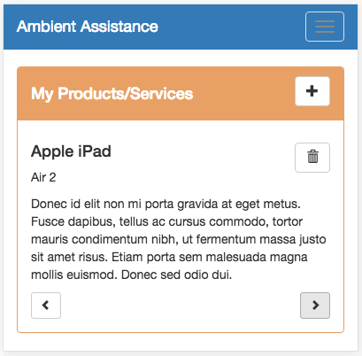
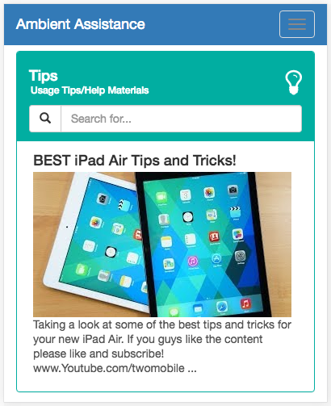
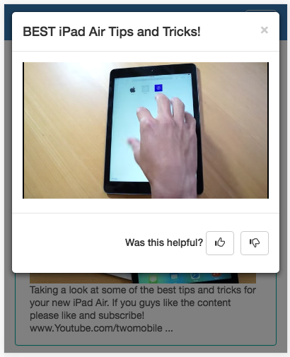
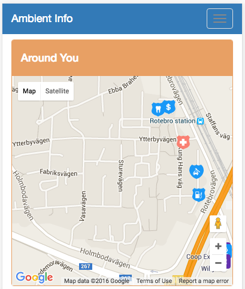
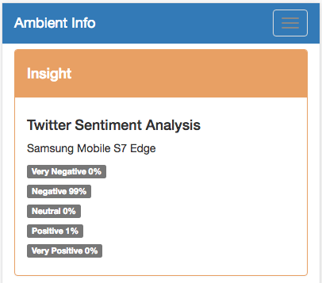

# AmbientInfo
Every person in nowadays is attached to set of products or services. They have their own preferred brands, service partner etc. The diversity of available products/services open for more options and even make harder for the right decision of selection.
AmbientInfo attempts describe this problem in term of ubiquitous computing and show the possibility of implementing a personalized assistance application.
AmbientInfo does not simply provide recommendations as an output of a query service. It further classifies the data model with use of Machine Learning algorithms like Collaborative Filtering and Natural Language Processing to provide more personalized recommendations.

### Application Context

 * Usage and Troubleshooting Tips: 
  The application captures registered products/services and recommends Usage/Troubleshooting Tips crawling over public content  service APIs, e.g Youtube, Google.
  
 * Recommend Products/Services: 
   TThe application may find users with similar preferences and recommend each other's products/services.

 * Around You: 
   The application read the current location of the users and provides with places that may user find useful around him.
   
 * Insight of Product/Service:
   The application reads tweets from the Twitter API and does a Sentiment Analysis of user’s products/services. Also derived information from Services and IoT data.
 
 * Sales Promotions:
 The application can expose a service API to business parties to publish their sales promotions, but the application will show only the relevances for the user.

The main entities that classify the application context are user’s own products and services. The advantage of this classification model is, the user’s own products may represent Internet of Things (IoT), e.g Smartphones/tablets, Smart-tv, Vehicle with smart devices etc. Also, most of the services these days open with RESTful/SOAP APIs (Internet of Services) to get the detail of their service usage.
Together with input from user’s profile and products/services, AmbientInfo queries on publicly available APIs and classify data using machine learning algorithms to provide more personalized features.

### System Overview

The main domain entities of the system are User’s Profile, Products, and Services. The Product itself can be IoTs or any standard thing with basic properties like manufacturer, model etc. The Services could be anything that user has subscribed with a provider.
All these domain entities act as the source of sense data for the system. Reading from user’s Profile, the system captures useful information of user’s age, language, city etc. From products, the system captures information like manufacture, type, model etc. If the product is an IoT, other useful information like user location and device specific data are also captured to show more insight of the product. In the same way, services provide information of the provider, service type, package etc to the system.
With all these sources of data, the system consolidates data further querying on public APIs. Then data classification with Machine learning algorithms (Sentimental Analysis and Collaborative filtering) are applied to meet user’s personalized features.

### System Context Features
#### Registered Products/Services

The user is provided with an option to enter his/her Product/Service details. Also, it may possible to auto detect user's newly purchase products/services. There are various possibilities to achieve this.
One option is to use transaction data of user’s Credit/Debit Cards with an integration of Bank or Financial institution's services. Using person transaction data, the application can build more knowledge of the user. It is possible to capture user’s frequently access shopping malls, type of purchases etc.
Another option is to access membership data of third parties. Most commercial entities provide with membership offers to improve their business. AmbientInfo can use (if possible) to capture these data to detect user’s product/services.

#### Recommended Usage/Troubleshooting Tips

The application recommends set of Usage tips based on registered products/services. The recommendation of Usage/Troubleshooting tips is based on Content-based filtering and Collaborative filtering. Content-based filtering is simply achieved with Query model of Youtube/Google APIs. Also, the application further captures user’s collaborative information (like/dislike, share, comments on contents) to rank the tips.

#### Around You

The application reads the current location of the user. This is possible with any modern devices. And use the user’s location information to discover near by resources that user may find useful.

The application prototype shows how Google Maps API is used to discover places around user’s current location. This can be further improved to provide more personalized information. For an example, if the user owns a vehicle there is high possibility user may interest of parking places or gas station around him/her. 

#### Insight

Sentiment Analysis is applied on Twitter feeds, to discover community view of Product/Service.
It is even possible to show more insight of the products/services. For an example, services like electricity can be brought into the application and show current usage of the electricity and compare it with past usage.
If the product is a device like Mobile/Tablet, the application can capture and show battery and memory usage of the device. This is possible with most IoT devices available today. 

